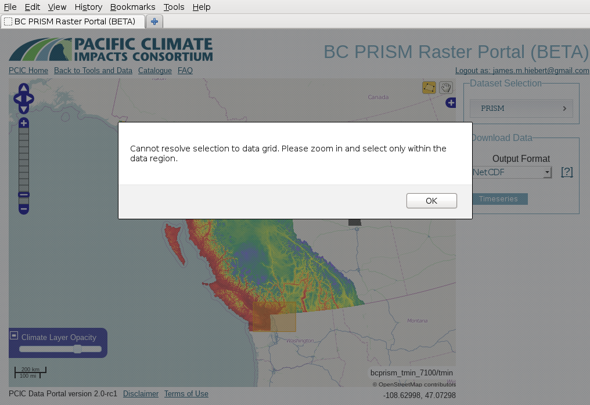

Frequently Asked Questions
==========================

How do I get help using the data portal?
----------------------------------------

We want the data portal to be useful and used by fellow scientists and researchers, and we'd love to help you to make that possible. If you have completely read the user docs and still need help, you're welcome to fill out a support issue and we'll try our best to help you out. Follow the guidelines in our :ref:`bug reporting guide <how-to-report-bugs>`, but tag the issue as "help wanted" instead of "bug". Please respect our time by keeping your questions succinct, specific and direct. If you do, there will be a greater probability that someone will take on the ticket. Open-ended questions titled "help me!!!111" will likely be ignored.

We have given several presentations about the data portal throughout its development. While they may not help you *use* the data portal, you are welcome to check out the slides and videos:

* James Hiebert addresses FOSS4G 2014 about why `Serving high-resolution sptatiotemporal climate data is hard <http://vimeo.com/106231595>`_
* James Hiebert speaks to PCIC staff about `version 2.0 of the PCIC Data Portal <http://www.slideshare.net/james_hiebert/hiebert-20140218-notes>`_
* James Hiebert addresses FOSS4G NA 2013 about `Web Delivery of Giant Climate Data Sets to Facilitate Open Science <http://www.slideshare.net/james_hiebert/web-delivery-of-giant-climate-data-sets-to-facilitate-open-science>`_
* James Hiebert speaks at AGU 2012 about `Web Services for Open Meteorological Data in British Columbia <http://www.slideshare.net/james_hiebert/hiebert>`_

Where can I report a bug or request a feature?
----------------------------------------------

Good question. Please see the :ref:`how-to-report-bugs` section in our :ref:`contributors-guide`.

Why do I have to login and what is OpenID?
------------------------------------------

A user login is required to download data so that we can track usage and gauge the degree to which we are providing effective services for our users. We collect the e-mail addresses of users for the sole purpose of contacting you in the unlikely event that major errors are found in the data or when major changes to the data in the portal are made. E-mail addresses are the only personal information that PCIC will gather and will be kept secure.

`OpenID <http://openid.net/get-an-openid/what-is-openid/>`_ allows you to use an existing account to sign in to multiple websites, without needing to create new passwords. For the user, OpenID provides the advantage that you can use a single account to log in to multiple websites.  For PCIC, OpenID provides the advantage that we do not have to maintain identity information and can minimize the personal information that we collect and store.

What is a NetCDF file and how do I use it?
------------------------------------------

NetCDF is a format for storing and transferring multidimensional data and all of its associated metadata. It's designed specifically for handing structured earth science data and climate model output. While PCIC's users occasionally balk at it for not being "user friendly", it's a roughly equivalent time investment for learning how to use it versus figuring out how to parse CSV output and reinstate all of the data structures that get lost in translation.

There is a fairly complete list of `NetCDF software <http://www.unidata.ucar.edu/software/netcdf/software.html>`_ available on Unidata's website. We often use the program `ncview <http://www.unidata.ucar.edu/software/netcdf/software.html#ncview>`_ to examine data. It's old, simple and crashes a bit, but it usually does a fine job of simple visualization on the desktop. There's also the `netcdf_tools <http://www.unidata.ucar.edu/software/netcdf/software.html#netcdf_tools>`_ which are basic command line tools to dump data, look at attributes, etc. For more sophisticated use, we frequently use `GDAL <http://www.unidata.ucar.edu/software/netcdf/software.html#GDAL>`_, and the `Python <http://www.unidata.ucar.edu/software/netcdf/software.html#Python>`_ and `R <http://www.unidata.ucar.edu/software/netcdf/software.html#R>`_ interfaces.

How do I interpret this climate data? (a.k.a, What is CF Metadata?)
-------------------------------------------------------------------

If you download our data in NetCDF format, you will also receive all of the accompanying metadata. The metadata should comply with international conventions regarding how to describe and interpret climate and forecast data. These conventions are known as the *CF Metadata Conventions*. A full description of the conventions is beyond the scope of this FAQ, but all the details that you could as for can be found `here <http://cf-pcmdi.llnl.gov/>`_.
 
Why can't I download climate model output in Excel?
---------------------------------------------------

Excel and spreadsheets in general are simply not designed to handle the large amounts of bulk data that come from climate models. Climate model output is multidimensional (lat x lon x time and sometimes x level) and Excel has no real concept of dimensionality. Excel *does* have rows and columns and as such it is common to represent two dimensional data with Excel, however, it is not designed for handling data that has three or four dimensions. Excel simply has a different data model than does climate model output.

Additionally, the size of data which the Excel format can handle is limited compared to what is required by climate model output. An Excel 2010 Worksheet is `limited to 1,048,576 rows by 16,384 columns <http://office.microsoft.com/en-ca/excel-help/excel-specifications-and-limits-HP010342495.aspx?CTT=5&origin=HP005199291>`_. Compare this to the data requirements of our Canada-wide downscaled climate coverage which has a spatial extent of 510x1068 cells (i.e. 544,680 cells) and a temporal extent of 55,152 timesteps. Neither the temporal extent, nor the spatial extent will fit within Excel's column limits. Even if we utilized each of the 17,179,869,184 available cells (ignoring and throwing away all of the data's structure), we would not have enough cells to store the dataset's 30,040,191,360 points. Excel *can* support multiple worksheets in a workbook, but the number of worksheets is limited by the memory of the system on which it is running. For the majority of standard desktops, this would be well short of the memory required to store climate model output.

To summarize, Excel is not designed for multi-dimensional data making it inconvenient and technically impossible.

Can I download climate model output in a "GIS-friendly" format?
---------------------------------------------------------------

This question is related to the above question about Excel. Like spreadsheets, most (all?) GIS software packages are designed to display data in only two coordinate dimensions (i.e. a map). Suppose that you download daily data for a ten year period, how would your GIS software visualize the resulting 3600 layers? GIS software packages are not designed for this purpose. In general, you're going to need to do additional, needs-specific processing before you can create climate maps with your GIS software.

In `version 2.1.0 <https://github.com/pacificclimate/pdp/blob/master/NEWS.rst#210>`_, we introduced the availability of the Arc/ASCII Grid format. This format only supports a single layer, so we deliver a Zip archive which contains one grid file per timestep. If downloading daily data, this is not recommended, but it *is* an option.

One final option is that if your GIS software can speak WMS and you want to map individual time steps, please review our :ref:`power user HOWTO <power-user>`.

How do I interpret the date fields in the data responses
--------------------------------------------------------

Unfortunately the `Open-source Project for a Network Data Access Protocol (OPeNDAP) <http://opendap.org/>`_ protocol does not support a native date type. Therefore, all of our data responses which include dates (i.e. nearly all of them) have to encode the dates using a floating point number. Typically, these dates are encoded as "days since 1970/01/01", however you should always check the units of the data response to be sure.

Note that much of the data in PCDS are irregular timeseries with changing frequency of measurement, or long gaps between measurements. Because of this, the values in the timevariable are *not* expected nor guaranteed to be of a regular frequency (e.g. daily or hourly). The data response only includes data for time value for which there exist measurements at that time.

If you're loading data files from the PCDS Portal into a spreadsheet program, typically you can see the human-readable dates by simply configuring the cell type for the time column to be of type "date".

For loading the NetCDF data files from the PCDS Portal, a recipe for getting the dates in Python looks something like this the following. First download a NetCDF file of the time variable: ::

    $ curl http://tools.pacificclimate.org/dataportal/data/pcds/lister/raw/EC/1054920.rsql.nc?station_observations.time > 1054920.nc

Then extract the time values into native datetime types: ::

    import netCDF4
    from datetime import datetime, timedelta
    
    ds = netCDF4.Dataset('1054920.nc')
    t = ds.variables['time']
    
    epoch = datetime(1970, 1, 1)
    times = [ epoch + timedelta(days=x) for x in t[:].tolist() ]

    for time in times[0:10]:
        print(time.isoformat())

Which will output: ::

    2011-10-16T00:00:00
    2011-10-16T01:00:28.125000
    2011-10-16T13:59:31.875000
    2011-10-16T15:00:00
    2011-10-16T16:00:28.125000
    2011-10-16T16:59:31.875000
    2011-10-16T18:00:00
    2011-10-16T19:00:28.125000
    2011-10-16T19:59:31.875000

When I try to download PRISM data, I'm told that the map "Cannot resolve selection to data grid". Why?
------------------------------------------------------------------------------------------------------

You see something like this?

This is an interesting problem and it turns out that it's because our PRISM data is actually *too* fine of a resolution. When you're zoomed out on the map, multiple pixels/grid cells of the PRISM raster are actually represented by a single screen pixel. For the web application to request the data subset from the data server, it has to be able to map a screen pixel (i.e. where you click when you select your rectangle) to a data pixel. If there are multiple data pixels per screen pixel (i.e. when you're zoomed out), then it's ambiguous and not determinable. For you to solve this, it *should* be sufficient to just zoom one or two steps. This issue only arises when your selection extends beyond the data area (and only beyond the southern and eastern extent). That's because to do the geographic clipping, the application has to reference yet another coordinate system (geographic). So in that case, the application has to reconcile three different coordinate systems (geographic, screen pixels, and PRISM grid cells) and there's not always enough information to resolve them.

Why is the "CSV" format nothing like what I expect? Why can't I import it into Excel?
-------------------------------------------------------------------------------------

Let me respond to the question with a question. What is CSV defined to be? There is not actual answer to that question. CSV is defined as "Character Separated Values", but aside from that, there's no provision for what character is the separator, what information should be included, how many rows/columns should exist, where to include attributes and metadata, and a wide variety of other questions. Essentially, no one, including any of our users, agrees 100% on the structure of a CSV, especially for attributed, multi-dimensional output. We provide CSV as a convenience, but it is impossible to make any guarantees that semantics and structure of CSV output will be unambiguous to all users. If you want well-defined, structured, attributed data, you should make the effort to learn and use NetCDF. It will make your life easier.

