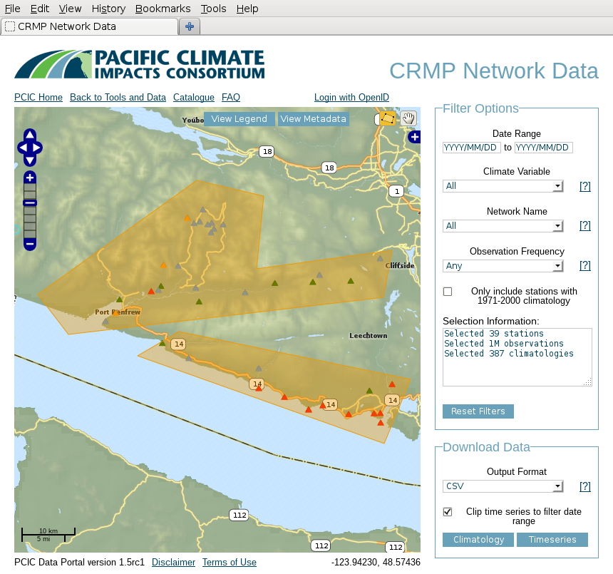
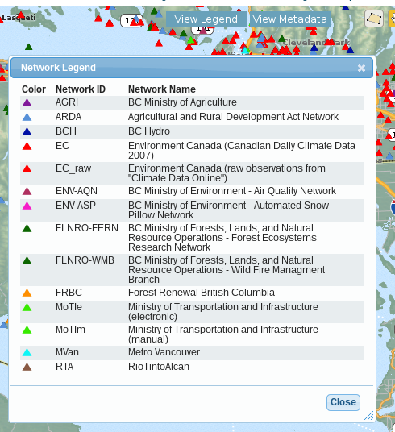
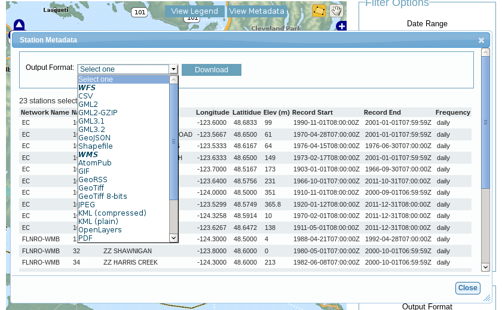
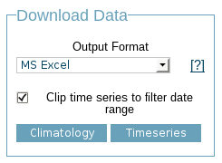

Provincial Climate Data Set Portal
----------------------------------

The Provincial Climate Data Set (PCDS) Portal contains observations of weather and climate variables (such as temperature and rainfall amounts) for British Columbia. Locations of observation stations are shown on an interactive map of the province which enables a user to zoom and pan to a region of interest, learn about the stations that are there, filter the displayed stations based on observation date, weather element, observing agency, region and more.

Searching for stations
^^^^^^^^^^^^^^^^^^^^^^

The primary supported method by which users can search for meteorological stations is by way of the map which takes up most of the screen real estate. The map shows all of the stations which meet the selection criteria in the "Filter Options" fieldset on the right-hand side of the window.

To navigate the map, one can either use the zoom/pan controls in the upper left hand corner of the map, or simply use left-click, drag to pan and the mouse scroll wheel to zoom.

.. figure:: images/nav.png

Note that zooming in to a particular area does not exclude stations which are out of your field of view. To select a spatial subset of stations, one can draw one or more polygons on the map. To do so you must first switch to the polygon selection tool in the upper right hand corner.

.. figure:: images/draw_polygon_on.png

Once in polygon selection mode you can start drawing a polygon by left-clicking on the map. This will add the first vertex and subsequent vertices can be added with further left clicks. To finish the polygon, double-left-click to add your final vertex. After you close your polygon, both the map and the "Selection Information" text box will automatically update.

There are several other controls available for further refining the selected stations. A user can select by date range, meteorologic variable, network name, frequency of observations and whether or not the stations have available a 1971-2000 normal period climatology. Selected stations are those which meet *all* of the constraints.

The "Date Range" option will select an stations for which their date range overlaps with the user supplied date range. Note that many PCDS stations *do* have gaps in the data, so this simple range check does not necessarily guarantee that select stations have data within the range.

The "Climate Variable" option allows a user to select only stations which record a given climate variable. Notice that there are many subtle difference in how various meteorological measurements are made. For example temperature can be recorded as a daily maximum ("Temperature (Max.)") or as an instantaneous measurement at regular intervals ("Temperature (point)"). Each of these differences in types of measure will show up as a different variable. Please note that while this select is used to filter stations, if you eventually download the data, you will receive *all* of the variables that are available for your selected stations.

The "Network Name" option allows a user to select only the stations which belong to a particular network/partner of the Climate Related Monitoring Program. The drop down menu shows the network abbreviations, but you may click on the question mark to the right or the "View Legend" button on the map to list out the full network names.

Finally, the "Observation Frequency" option allows a user to select stations having a particular time interval between measurements. For example, you can select hourly data, daily data, or several others. Note that the indicated frequency of data is true for the majority of the observations, however it is only a guideline. The true time interval between measurements can and most likely will vary.

Getting station info
^^^^^^^^^^^^^^^^^^^^

Searching for stations using the map is a much easier way to find station than is wading through a long spreadsheet of station attributes. That said, there can be substantial value and many use cases for obtaining the list of station attributes. Through the PCDS Portal, you can download the station attributes in a way that is dynamic and responsive to the user input of filters.

To obtain station attributes, there are a couple ways to view them. For single stations, the easiest way is to left-click directly on the station symbols on the map. This action will pop up a window showing many of the attributes, for example; network name, station name, and location (latitude, longitude, elevation). If you're interested in *all* of the selected stations, you can left-click the "View Metadata" button at the top of the map. This action opens a window which provides the same attributes, but for all stations. Finally, if you want to download the station metadata, you can click the "Download" button and select one of the supported output formats.

One should note that the Download button produces a `Web Feature Service (WFS) <http://www.opengeospatial.org/standards/wfs>`_ or `Web Map Service (WMS) <http://www.opengeospatial.org/standards/wms>`_ request and are grouped accordingly in the selection box. WFS requests are useful for downloading the actual station attributes. For example, a WFS request for the CSV format will return a CSV table containing attributes for all of the stations. A WFS request for the Shapefile format will return an ESRI Shapefile containing point geometries for all of the selected stations and the attributes table. WMS requests are typically "just" images of the selected stations. Whether or not the images contain any geospatial information is format dependent. For example, GoogleEarth (KML) and GeoTiff files will be spatially referenced while JPEG and PNG files will *not* be spatially referenced.

Finally, the selection information box on the right-hand side of the screen provides a coarse level of information estimating the amount of data that you would download with your present selection. It is updated automatically anytime you change your filter options or polygon selection.

.. figure:: images/selection_info.png

Retrieving station data
^^^^^^^^^^^^^^^^^^^^^^^

The final step in using the data portal, downloading station data, is typically the easiest. To download, just go to the "Download Data" fieldset, select your desired output format, and then click either the "Climatology" button (if you want climatologies) or the "Timeseries" button, if you want the raw observations. The only additional option is a checkbox to optionally "Clip time series to filter date range". If this is checked, your download will only include observations between the start date and end date that you have indicated above in the filter options. If unchecked, you will simply get the full time range for all selected stations.

The data response will be returned as a ZIP archive containing one folder per network. Each network folder contains one data file for each station, and a CSV file describing the variables collected by this network.

Unexpected Behaviour
^^^^^^^^^^^^^^^^^^^^

There are a few nuances to the aggregated data download that work the way the user expectes *most* of the time, but may be unexpected in a variety of ways.

1. Even if you zoom in the the map and limit your field of view, there may be selected stations that extend beyond the field of view. Stations are selected based on your entire set of filters, and are completely unaffected by your view on the map.
2. When downloading data, all variables for a selected station are included in the download *regardless of whether you filter by variable*. This is slightly different behaviour than is exhibited by the time selection, so it's a point that warrants attention.
3. When downloading timeseries data, if you have selected stations by drawing a polygon but have not filtered those stations by date range or meterological variable, your selection may include stations with no data available. Files for these stations will still appear in your downloaded archive, but they will not contain any observations, only metadata and headings.

Station Listings
^^^^^^^^^^^^^^^^

If one is interested in exploring the station offerings in a hiearchical listing format (as opposed to a map), we offer a station listings interface available at the URL http://tools.pacificclimate.org/dataportal/data/pcds/lister

These listing pages lay out the stations in a hierarchy splitting on raw data vs. climatology ("raw|climo"), CRMP network, and finally station. For example, to list all of the climatologies available for the BC Hydro network, one would navigate to http://tools.pacificclimate.org/dataportal/data/pcds/lister/climo/BCH/

The page for a single station includes a simple HTML page that lists all global metadata, all variables for the station, and it provides some form controls to download individual variables. Please note that you must select the checkbox for *each and every* variable that you want to download. None are selected by default, so clicking "Download" without any prior action will result in a bad request.

Advanced/Programmatic Usage
^^^^^^^^^^^^^^^^^^^^^^^^^^^

In theory, the whole data portal is written using open protocols and an advanced user with some scripting abilities should be able to reasonably script up a bulk download (assuming that the filters on the user interface do not cover your use case).

For your purposes of demonstration, let's assume that a user is interested in downloading data from a whole bunch of Wildfire Management Branch stations, network code "FLNRO-WMB". From our instance of Pydap, you can get a station listing from the `data listing pages <http://tools.pacificclimate.org/dataportal/data/pcds/lister/raw/FLNRO-WMB/>`_.

If you have a list of network_name/station_ids (where station_id is the id by which it is called *by the network*, then you can patch together a URL for the full data download. For example, if you wanted to download FLNRO-WMB data for station "1002", the URL would be http://tools.pacificclimate.org/dataportal/data/pcds/lister/raw/FLNRO-WMB/1002.rsql.csv

The file format extension on the end can be [csv|xls|ascii|nc].

Further subselections are possible with URL query string parameters, but for that, one should refer to the `OPeNDAP documentation <http://www.opendap.org/pdf/ESE-RFC-004v1.2.pdf>`_.

This is all relatively simple, however, if one is going to script it, you must also handle the OpenID login which can be a little tricky. We advise that you first login with your standard web browser and establish a session. Find the beaker.session.id cookie for the domain tools.pacificclimate.org and then look at the wget line in the user docs :ref:`metadata-and-data`.

Essentially, you do something like: ::

  wget --output-document=[your_data_file] --header "Cookie: beaker.session.id=[your_session_id]" [your_url] 2> /dev/null

