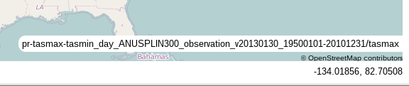
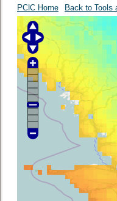
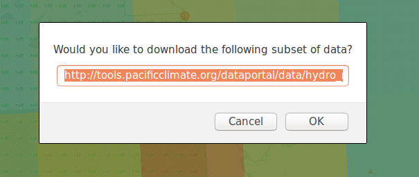
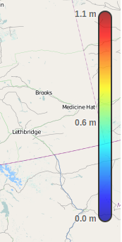
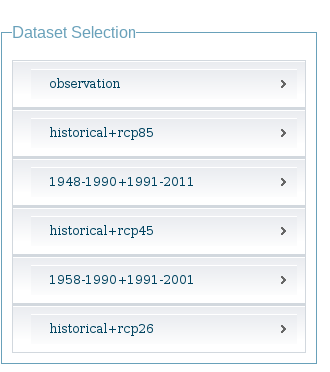
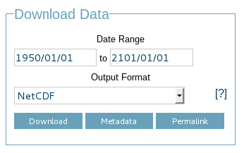

Climate Coverage Portals
========================

The Climate `Coverage <http://en.wikipedia.org/wiki/Coverage_data>`_ Portals make available spatiotemporal climate data for a number of PCIC's products such as downscaled climate model output, high resolution climatologies, and hydrologic model output. This bulk data is necessarily very large which presents both opportunities and challenges. A single scenario of BCSD downscaling output (of which there are dozens) requires about 15GB of binary storage (more for ASCII). Subsets can be much smaller, however if you as a user are not prepared for handling many large files such as these, we recommend that you consider leveraging PCIC's interpreted products and services or other web tools such as the `Regional Analysis Tool <http://www.pacificclimate.org/tools-and-data/regional-analysis-tool>`_ or `Plan2Adapt <http://www.pacificclimate.org/tools-and-data/plan2adapt>`_. If you *are* prepared to download, store, and process bulk data, then please read on.

Each page which constitutes a "Climate Coverage Portal" exposes an *ensemble* of data. This ensemble should not be confused with the concept of a climate model ensemble which is used for model intercomparison. In this context an ensemble is simply a set of related files that are published together in the same place. Typically ensemble members have the same spatial domain and a similar purpose and are the result of a single project. For example, all of the Canada-wide BCSD downscaled data is in the same ensemble.

A single page provides three elements:

+ a map is available for limited visualization of the coverage domain, and to select a rectangular area for which to download data
+ a "Dataset Selection" fieldset is available, listing all of the ensemble's datasets available for download
+ a "Download Data" fieldset is shown which allows the user to select a temporal subset, output format and start a download

The user interface only provides the means to download a single dataset. However, we do expose all of the information necessary to script together multiple downloads. In interested in this, please see the advanced user documentation for more details.

Map
---

The map shows a single time step of the selected dataset. The dataset's unique id is shown in the lower right hand corner of the map.

To navigate the map, one can either use the zoom/pan controls in the upper left hand corner of the map, or simply use left-click, drag to pan and the mouse scroll wheel to zoom.

To select a spatial subset for data download, one must first switch to the polygon selection tool in the upper right hand corner.

.. figure:: images/draw_polygon_on.png

When in spatial subset selection mode, you can select a rectangular area by doing a left-click and drag. When selecting an area on high resolution datasets (e.g. BC PRISM), there is the possibility that the user interface will not resolve from screen resolution to dataset resolution. If this is the case, you will be prompted. The can usually be alleviated by zooming the map to a higher zoom level when performing your selection.

The raster portals also provide a point tool which can be used to download a single cell of data. To use, select the point tool icon located in the map control panel.

Once selected, zoom in and click the cell that you wish to download. A prompt will appear asking for confirmation of the download and display a link corresponding to the precise cell of data that was clicked.

This URL can be edited before the download is confirmed; any changes will be reflected in the downloaded dataset. *Note: The point tool does not currently support the ARC/Info ASCII Grid output format.*

To adjust the opacity of the climate overlay, there is an opacity slider in the lower left hand corner.

.. figure:: images/opacity_slider.png

The map is a standard `OpenLayers <http://openlayers.org/>`_ map, so for more details on usage, please refer to the `OpenLayers documentation <http://trac.osgeo.org/openlayers/wiki/Documentation>`_.

To switch back to navigating mode after selecting, you must re-select the hand icon

.. figure:: images/pan_on.png

Each of the raster portals will display a colorbar legend indicating the range of values for the selected dataset. The minimum and maximum values are determined from the entire dataset, regardless of whether a subset was selected or not.

This scale is linear for temperature variables and logarithmic for precipitation.

Dataset selection
-----------------

The dataset selection fieldset shows a hierarchically organized list of all datasets available for this ensemble.

Clicking on category names will expand/collapse all of the data offerings under that category. Clicking on a dataset name at the base of the hierarchy will change the climate overlay which is shown on the map, will update the available dates in the download data fieldset and will generally *select* the dataset such that it will be the one downloaded.

Download data
-------------

The download data fieldset allows a user to select the time range for which data will be downloaded and an output format. Only output formats which support multidimensional data are offered which includes NetCDF and Character Separated Values (CSV). Some data pages also support downloading ArcInfo / ASCII Grid files.

The download area has three buttons: `Download`, `Metadata`, and `Permalink`.

The `Download` button starts the download of data with whichever format you have selected. The `Metadata` button will make an `OPeNDAP Data Attribute Structure <http://docs.opendap.org/index.php/UserGuideDataModel#Data_Access_Protocol>`_ request, returning all of the attributes for your selected dataset. The `Permalink` button simply opens an alert box with the URL that *would* be opened if you hit the `Download` button. This is useful if you want to write a wget script or something similar to perform light automation of downloads. See the `Power user HOWTO`_ for more details on how to do this.

Output Data Formats
^^^^^^^^^^^^^^^^^^^

The climate coverage portals support several output formats.

NetCDF
""""""

We *highly* recommend that users take the time to learn how to use and download data with the NetCDF format. NetCDF is the only data portal output format which natively supports multidimensional data and which includes all of the metadata (both the attributes and information about the data structure and axes). If you insist on using one of the other formats, you will have to download, manage and reconstruct this meta information on your own.

The PCIC Data Portal returns NetCDF version 3 (i.e. "classic") files. NetCDF 3 files are not compressed at the file level, however network bandwidth is preserved by using gzip over HTTP. If you will be storing these files for a while, we recommend that you convert the files to a NetCDF 4, compressed file. You can do this with the nccopy command, that comes with the standard NetCDF command line tools.

    $ nccopy -k netCDF-4 -d 4 [input_file] [output_file]

CSV
"""

This CSV format is a plain text / ASCII format that attempts to maintain the structure of the multidimensional grid. The output *is* a bit confusing and is not what people typically expect. This is primarily because there exists no standard definition for the CSV format, and it is--to some degree--a tabular format. Three dimensional data does not fit in a table, so some adjustments have to be made to represent this.

Layout of the data is time-major, longitude-minor; that is, time is the slowest varying dimension, while longitude is the fastest varying dimension (latitude is in the middle). Consider this example: ::

    james@basalt ~ $ wget --output-document=/tmp/sample.csv 'https://data.pacificclimate.org/data/downscaled_gcms/pr+tasmax+tasmin_day_BCSD+ANUSPLIN300+CanESM2_historical+rcp26_r1i1p1_19500101-21001231.nc.csv?tasmax[0:9][100:101][250:253]&'
    --2014-04-23 15:01:53--  https://data.pacificclimate.org/data/downscaled_gcms/pr+tasmax+tasmin_day_BCSD+ANUSPLIN300+CanESM2_historical+rcp26_r1i1p1_19500101-21001231.nc.csv?tasmax[0:9][100:101][250:253]&
    Resolving data.pacificclimate.org... 142.104.230.35
    Connecting to data.pacificclimate.org|142.104.230.35|:80... connected.
    HTTP request sent, awaiting response... 200 OK
    Length: unspecified [text/plain]
    Saving to: ‘/tmp/sample.csv’

	[ <=>    ] 1,816       --.-K/s   in 0.04s

    2014-04-23 15:01:53 (43.2 KB/s) - ‘/tmp/sample.csv’ saved [1816]

We have downloaded 10 timesteps of a downscaled GCM data and saved it to /tmp/sample.csv. The file looks like this: ::

    tasmax.tasmax
    [[1.3299999237060547, 1.5899999141693115, 1.5999999046325684, 1.7599999904632568], [1.6100000143051147, 1.6899999380111694, 1.5799999237060547, 1.7300000190734863]]
    [[0.47999998927116394, -0.3499999940395355, -1.4199999570846558, -1.149999976158142], [-0.7400000095367432, -0.75, -1.2899999618530273, -1.0299999713897705]]
    [[0.009999999776482582, -0.5600000023841858, -1.8799999952316284, -1.5999999046325684], [-0.9599999785423279, -1.0499999523162842, -1.809999942779541, -1.5399999618530273]]
    [[-2.4800000190734863, -3.259999990463257, -5.039999961853027, -4.569999694824219], [-4.269999980926514, -4.279999732971191, -5.159999847412109, -4.710000038146973]]
    [[-3.0, -3.6999998092651367, -5.159999847412109, -4.900000095367432], [-4.299999713897705, -4.440000057220459, -5.230000019073486, -4.989999771118164]]
    [[-2.190000057220459, -3.0899999141693115, -4.699999809265137, -4.279999732971191], [-4.049999713897705, -4.059999942779541, -4.799999713897705, -4.420000076293945]]
    [[-6.730000019073486, -6.929999828338623, -8.260000228881836, -7.789999961853027], [-7.460000038146973, -7.409999847412109, -8.210000038146973, -7.730000019073486]]
    [[-5.059999942779541, -5.609999656677246, -6.769999980926514, -6.559999942779541], [-6.179999828338623, -6.279999732971191, -6.920000076293945, -6.71999979019165]]
    [[-5.130000114440918, -5.769999980926514, -7.089999675750732, -6.869999885559082], [-6.37999963760376, -6.519999980926514, -7.230000019073486, -7.039999961853027]]
    [[-4.0, -4.110000133514404, -4.480000019073486, -4.369999885559082], [-4.319999694824219, -4.339999675750732, -4.599999904632568, -4.509999752044678]]
    tasmax.time
    0.0
    1.0
    2.0
    3.0
    4.0
    5.0
    6.0
    7.0
    8.0
    9.0
    tasmax.lat
    [49.374999665, 49.458332995]
    tasmax.lon
    [-120.12500083500001, -120.04166750499999, -119.958334175, -119.875000845]

The file lists data for four properties: tasmax, time, lat, and lon.
The first thing that the file lists is the data from the variable that we requested, in this case `tasmax` or daily maximum temperature. Thereafter, it lists values that correspond to each of the axes in the hyper cube from major dimension (time) to minor dimension(lon). Interpreting the multidimensional values of `tasmax` can be non-trivial. Each line corresponds to one step of the major dimension (i.e time). Each line lists a two-dimensional array, where latitude is the major dimension and longitude is the minor dimension. Therefor the first two lines of data can be interpreted as: ::

    timestep0: [[ tasmax at lat0:lon0, tasmax at lat0:lon1, tasmax at lat0:lon2, tasmax at lat0:lon3], [tasmax at lat1:lon0, tasmax at lat0:lon1, tasmax at lat0:lon2, tasmax at lat0:lon3]]
    timestep1: [[ tasmax at lat0:lon0, tasmax at lat0:lon1, tasmax at lat0:lon2, tasmax at lat0:lon3], [tasmax at lat1:lon0, tasmax at lat1:lon1, tasmax at lat1:lon2, tasmax at lat1:lon3]]
    ...

Please note that the CSV contains no attributed metadata such as references, variable units, variable descriptions, fill values, etc., all of which you almost certainly want. You can retrieve these attributes with the "Metadata" button on the map page (or they are included if you download using NetCDF, instead).

ArcInfo/ASCII Grid
""""""""""""""""""

Like the CSV response, ArcInfo/ASCII Grid files are not multidimensional. In fact, each of these files can only represent a map (lat vs. lon) at one single timestep. Because of this, the download response is a bit different than the other formats. Each response will consist of a Zip archive which contains one .asc file and one .prj (projection) file for each time step. Users of this format for daily data should be forewarned that Arc will not perform well when attempting to load dozens (or hundreds, or thousands!) of layers in one session. If you download more than 32767 timesteps (corresponding to about 90 years of daily data) at once, you will receive a Zip64-encoded zip archive. Some older applications may not be able to read Zip64-encoded archives.

.. _power-user:

Power user HOWTO
----------------

A user with experience in programming or scripting should be able to reasonably recreate functionality of the Climate Coverage Portal in a programmatic manner. This section describes some of the deployment details that one would require to do so.

Map
^^^
All mapping is provided using open geospatial protocols. Base maps may be requested using `Open Source Geospatial Foundation's (OSGeo) <http://www.osgeo.org>`_ `Tile Map Service Specification <http://wiki.osgeo.org/wiki/Tile_Map_Service_Specification>`_. We deploy our basemaps via Tilecache and they can be accessed at https://a.tile.pacificclimate.org/tilecache/tilecache.py.

Climate raster overlays are served via the `OSGeo's Open Geospatial Consortium's (OGC) <http://www.opengeospatial.org/>`_ `Web Mapping Service (WMS) protocol <http://www.opengeospatial.org/standards/wms>`_. To obtain the climate raster overlays, one may make a valid WMS request to our deployment of `ncWMS <http://www.resc.rdg.ac.uk/trac/ncWMS/>`_ located at https://tools.pacificclimate.org/ncWMS-PCIC.

Dataset listings
^^^^^^^^^^^^^^^^
The climate coverage data portal serves listings of the available datasets via a JSON-encoded response. This is how the web user interface retrieves the data lists, however power users have access to it as well from this URL: ``https://data.pacificclimate.org/portal/[page_id]/catalog/catalog.json``. For example, if one wanted to retrieve a list of the datasets available for the BC PRISM page, one could do the following: ::

  james@basalt ~ $ wget --output-document=- https://data.pacificclimate.org/portal/bc_prism/catalog/catalog.json 2> /dev/null
  {
  "tmin_mon_PRISM_historical_19500131-20071231_bc": "https://data.pacificclimate.org/data/bc_prism/bc_tmin_monthly_CAI_timeseries_19500101_20071231.nc",
  "pr_mon_PRISM_historical_19500131-20071231_bc": "https://data.pacificclimate.org/data/bc_prism/bc_ppt_monthly_CAI_timeseries_19500101_20071231.nc",
  "pr_monClim_PRISM_historical_run1_198101-201012": "https://data.pacificclimate.org/data/bc_prism/pr_monClim_PRISM_historical_run1_198101-201012.nc",
  "tmax_monClim_PRISM_historical_run1_197101-200012": "https://data.pacificclimate.org/data/bc_prism/tmax_monClim_PRISM_historical_run1_197101-200012.nc",
  "pr_monClim_PRISM_historical_run1_197101-200012": "https://data.pacificclimate.org/data/bc_prism/pr_monClim_PRISM_historical_run1_197101-200012.nc",
  "tmax_mon_PRISM_historical_19500131-20071231_bc": "https://data.pacificclimate.org/data/bc_prism/bc_tmax_monthly_CAI_timeseries_19500101_20071231.nc",
  "tmin_monClim_PRISM_historical_run1_198101-201012": "https://data.pacificclimate.org/data/bc_prism/tmin_monClim_PRISM_historical_run1_198101-201012.nc",
  "tmax_monClim_PRISM_historical_run1_198101-201012": "https://data.pacificclimate.org/data/bc_prism/tmax_monClim_PRISM_historical_run1_198101-201012.nc",
  "tmin_monClim_PRISM_historical_run1_197101-200012": "https://data.pacificclimate.org/data/bc_prism/tmin_monClim_PRISM_historical_run1_197101-200012.nc"
  }

The JSON output gives you a mapping between the dataset's unique ID and the base URL for a DAP request (described below).

You can retrieve the catalog with your favorite programming languages as well. For example in R, you could do something like this: ::

  > library(rjson)
  > json_file <- 'https://data.pacificclimate.org/portal/downscaled_gcms/catalog/catalog.json'
  > json_data <- fromJSON(paste(readLines(json_file), collapse=""))

  > names(json_data)
  [1] "pr-tasmax-tasmin_day_BCCAQ-ANUSPLIN300-GFDL-ESM2G_historical-rcp45_r1i1p1_19500101-21001231"
  [2] "pr-tasmax-tasmin_day_BCCAQ-ANUSPLIN300-CCSM4_historical-rcp45_r2i1p1_19500101-21001231"
  ...

  > json_data[[1]]
  [1] "https://data.pacificclimate.org/data/downscaled_gcms/pr+tasmax+tasmin_day_BCCAQ+ANUSPLIN300+GFDL-ESM2G_historical+rcp45_r1i1p1_19500101-21001231.nc"

At present, there are seven pages for which one can retrieve catalogs: ``bc_prism``, ``downscaled_gcms``, ``downscaled_gcmws_archive``, ``downscaled_gcm_extremes``, ``gridded_observations``, ``hydro_model_archive``, and ``hydro_model_out``.

.. _metadata-and-data:

Metadata and Data
^^^^^^^^^^^^^^^^^
All of our multidimensional raster data is made available via `Open-source Project for a Network Data Access Protocol (OPeNDAP) <http://opendap.org/>`_, the specification of which can be found `here <http://www.opendap.org/pdf/ESE-RFC-004v1.2.pdf>`_. Requests are serviced by our deployment of the `Pydap server <http://www.pydap.org/>`_ which PCIC has heavily modified and rewritten to be able to stream large data requests.

The *structure* and *attributes* of a dataset can be retrieved using OPeNDAP by making a `DDS or DAS <http://www.opendap.org/api/pguide-html/pguide_6.html>`_ request respectively. For example, to determine how my timesteps are available from one of the BCSD datasets, one can make a DDS request against that dataset as such: ::

  james@basalt ~ $  wget --output-document=- https://data.pacificclimate.org/portal/downscaled_gcms/catalog/pr+tasmax+tasmin_day_BCSD+ANUSPLIN300+MPI-ESM-LR_historical+rcp26_r3i1p1_19500101-21001231.h5.dds 2> /dev/null
  Dataset {
      Float64 lat[lat = 510];
      Float64 lon[lon = 1068];
      Grid {
	  Array:
	      Int16 pr[time = 55152][lat = 510][lon = 1068];
	  Maps:
	      Float64 time[time = 55152];
	      Float64 lat[lat = 510];
	      Float64 lon[lon = 1068];
      } pr;
      Grid {
	  Array:
	      Int16 tasmax[time = 55152][lat = 510][lon = 1068];
	  Maps:
	      Float64 time[time = 55152];
	      Float64 lat[lat = 510];
	      Float64 lon[lon = 1068];
      } tasmax;
      Grid {
	  Array:
	      Int16 tasmin[time = 55152][lat = 510][lon = 1068];
	  Maps:
	      Float64 time[time = 55152];
	      Float64 lat[lat = 510];
	      Float64 lon[lon = 1068];
      } tasmin;
      Float64 time[time = 55152];
  } pr%2Btasmax%2Btasmin_day_BCSD%2BANUSPLIN300%2BMPI-ESM-LR_historical%2Brcp26_r3i1p1_19500101-21001231%2Eh5;

You can see the the response clearly describes all variable which are available from the dataset as well as their dimensionality and dimension lengths. To get attribute information for the dataset, you can make a DAS request as such: ::

  james@basalt ~ $ wget --output-document=- https://data.pacificclimate.org/portal/downscaled_gcms/catalog/pr+tasmax+tasmin_day_BCSD+ANUSPLIN300+MPI-ESM-LR_historical+rcp26_r3i1p1_19500101-21001231.h5.das 2> /dev/null
  Attributes {
      NC_GLOBAL {
	  String comment "Spatial dissagregation based on tasmin/tasmax; quantile mapping extrapolation based on delta-method";
	  String target_references "McKenney, D.W., Hutchinson, M.F., Papadopol, P., Lawrence, K., Pedlar, J.,
  Campbell, K., Milewska, E., Hopkinson, R., Price, D., and Owen, T.,
  2011. Customized spatial climate models for North America.
  Bulletin of the American Meteorological Society, 92(12): 1611-1622.

  Hopkinson, R.F., McKenney, D.W., Milewska, E.J., Hutchinson, M.F.,
  Papadopol, P., Vincent, L.A., 2011. Impact of aligning climatological day
  on gridding daily maximum-minimum temperature and precipitation over Canada.
  Journal of Applied Meteorology and Climatology 50: 1654-1665.";
	  String driving_experiment "MPI-ESM-LR, historical+rcp26, r3i1p1";
	  String target_dataset "ANUSPLIN interpolated Canada daily 300 arc second climate grids";
	  String creation_date "2013-03-27T23:45:46Z";
	  String frequency "day";
	  String references "Wood, A.W., Leung, L.R., Sridhar, V., and Lettenmaier, D.P., 2004.
  Hydrologic implications of dynamical and statistical approaches to
  downscaling climate model outputs. Climatic Change, 62: 189-216.";
	  String driving_experiment_name "historical, RCP2.6";
	  String target_institute_id "CFS-NRCan";
	  String title "Bias Correction/Spatial Disaggregation (BCSD) downscaling model output for Canada";
	  String source "Downscaled from MPI-ESM-LR historical+rcp26 r3i1p1 to ANUSPLIN300 gridded observations";
	  String version "1";
	  String driving_model_ensemble_member "r3i1p1";
	  String realization "1";
	  String driving_institute_id "MPI-M";
	  String driving_model_id "MPI-ESM-LR";
	  String institute_id "PCIC";
	  String product "output";
	  String target_version "canada_daily_standard_grids";
	  String target_history "obtained: 2 April 2012, 14 June 2012, and 30 January 2013";
	  String target_id "ANUSPLIN300";
	  String modeling_realm "atmos";
	  String institution "Pacific Climate Impacts Consortium (PCIC), Victoria, BC, www.pacificclimate.org";
	  String target_contact "Pia Papadopol (pia.papadopol@nrcan-rncan.gc.ca)";
	  String driving_institution "Max-Planck-Institut fur Meteorologie (Max Planck Institute for Meteorology)";
	  String target_institution "Canadian Forest Service, Natural Resources Canada";
	  String Conventions "CF-1.4";
	  String contact "Alex Cannon (acannon@uvic.ca)";
	  String history "created: Wed Mar 27 15:45:46 2013";
      }
      DODS_EXTRA {
	  String Unlimited_Dimension "time";
      }
      lat {
	  String long_name "latitude";
	  String standard_name "latitude";
	  String NAME "lat";
	  String units "degrees_north";
	  String CLASS "DIMENSION_SCALE";
	  String axis "Y";
      }
      lon {
	  String long_name "longitude";
	  String standard_name "longitude";
	  String NAME "lon";
	  String units "degrees_east";
	  String CLASS "DIMENSION_SCALE";
	  String axis "X";
      }
      pr {
	  Int16 _FillValue -32768;
	  Float32 scale_factor 0.025;
	  Float32 add_offset 750;
	  String long_name "Precipitation";
	  String standard_name "precipitation_flux";
	  String cell_methods "time: mean";
	  String units "mm day-1";
	  Int16 missing_value -32768;
      }
      tasmax {
	  Int16 _FillValue -32768;
	  Float32 scale_factor 0.01;
	  Float32 add_offset 0;
	  String long_name "Daily Maximum Near-Surface Air Temperature";
	  String standard_name "air_temperature";
	  String cell_methods "time: maximum";
	  String units "degC";
	  Int16 missing_value -32768;
      }
      tasmin {
	  Int16 _FillValue -32768;
	  Float32 scale_factor 0.01;
	  Float32 add_offset 0;
	  String long_name "Daily Minimum Near-Surface Air Temperature";
	  String standard_name "air_temperature";
	  String cell_methods "time: minimum";
	  String units "degC";
	  Int16 missing_value -32768;
      }
      time {
	  String long_name "time";
	  String standard_name "time";
	  String NAME "time";
	  String units "days since 1950-01-01 00:00:00";
	  String calendar "gregorian";
	  String CLASS "DIMENSION_SCALE";
      }
  }

Such a request would useful for retrieving data units in advance of downloading the data or for filtering according to driving model or institute.

Downloading the actual data values themselves is also done with a DAP request. There are a couple differences, however. First, to download data, the client must be logged in via OpenID. Secondly, the URL template for the request is ``https://data.pacificclimate.org/data/[page_id]/[dataset_id].[format_extension]?[dap_selection]``

*format_extension* can be one of: nc, csv, ascii.

To construct a proper DAP selection, please refer to the `DAP specification <http://www.opendap.org/pdf/ESE-RFC-004v1.2.pdf>`_. For example, if you wanted to download the first two timesteps and an 11 by 11 spatial region of the BCSD downscaling data you could make a request as follows: ::

  james@basalt ~ $ wget --output-document=- https://data.pacificclimate.org/data/downscaled_gcms/pr+tasmax+tasmin_day_BCSD+ANUSPLIN300+MPI-ESM-LR_historical+rcp26_r3i1p1_19500101-21001231.nc.csv?tasmin[0:1][200:210][200:210] 2> /dev/null
  tasmin.tasmin
  [[-1499, -1490, -1468, -1474, -1440, -1395, -1377, -1363, -1386, -1360, -1335], [-1447, -1404, -1401, -1395, -1381, -1389, -1355, -1363, -1367, -1328, -1302], [-1499, -1490, -1500, -1441, -1346, -1354, -1332, -1314, -1309, -1292, -1285], [-1505, -1469, -1475, -1426, -1370, -1366, -1344, -1345, -1307, -1292, -1286], [-1429, -1433, -1395, -1366, -1367, -1348, -1329, -1314, -1299, -1294, -1284], [-1452, -1418, -1397, -1393, -1366, -1338, -1327, -1297, -1289, -1285, -1288], [-1393, -1401, -1378, -1371, -1349, -1345, -1311, -1293, -1280, -1287, -1312], [-1422, -1357, -1347, -1337, -1323, -1319, -1297, -1281, -1276, -1312, -1314], [-1421, -1388, -1374, -1361, -1340, -1324, -1293, -1277, -1272, -1299, -1295], [-1395, -1384, -1365, -1346, -1331, -1311, -1287, -1274, -1277, -1277, -1282], [-1398, -1376, -1355, -1335, -1320, -1297, -1277, -1286, -1289, -1283, -1271]]
  [[-2126, -2116, -2087, -2101, -2051, -1976, -1950, -1930, -1980, -1940, -1899], [-2044, -1971, -1974, -1970, -1950, -1975, -1916, -1940, -1954, -1884, -1833], [-2137, -2128, -2150, -2060, -1885, -1914, -1875, -1843, -1840, -1805, -1796], [-2151, -2100, -2116, -2042, -1947, -1947, -1913, -1923, -1846, -1813, -1808], [-2030, -2045, -1986, -1937, -1950, -1918, -1888, -1865, -1835, -1830, -1811], [-2075, -2025, -1994, -1996, -1954, -1906, -1895, -1830, -1818, -1814, -1829], [-1975, -2000, -1965, -1961, -1927, -1930, -1867, -1829, -1800, -1828, -1894], [-2033, -1911, -1901, -1894, -1872, -1878, -1839, -1808, -1797, -1895, -1903], [-2034, -1985, -1970, -1954, -1922, -1899, -1838, -1804, -1794, -1873, -1868], [-1993, -1981, -1955, -1926, -1906, -1874, -1829, -1804, -1818, -1821, -1838], [-2000, -1968, -1935, -1901, -1883, -1840, -1805, -1845, -1858, -1845, -1812]]
  tasmin.time
  0.0
  1.0

Note that for this example the temperature values are all packed integer values and to obtain the proper value you may need to apply a floating point offset and/or scale factor which are available in the DAS response and the netcdf data response.

Download multiple variables
^^^^^^^^^^^^^^^^^^^^^^^^^^^

For users that are interested in downloading multiple variables for a single dataset, this *is* possible for certain datasets. The web user interface does not expose this functionality, but if you are willing to do some scripting or URL hacking, you'll be rewarded with a faster download.

To determine whether your dataset of interest contains multiple variables, check by reading the `Dataset Descriptor Structure (DDS) <http://docs.opendap.org/index.php/UserGuideOPeNDAPMessages>`_. You can get this by making a request to the dataset of interest with the ".dds" suffix appended to the end. E.g. the following DDS request shows that the dataset in question contains 3 independent variables (pr, tasmax, tasmin) and 3 axis variables (lon ,lat, time). All of those are requestable in a single request. ::

  james@basalt:~$ curl 'https://data.pacificclimate.org/data/downscaled_gcms/pr+tasmax+tasmin_day_BCCAQ+ANUSPLIN300+MPI-ESM-LR_historical+rcp26_r3i1p1_19500101-21001231.nc.dds'
  Dataset {
  Float64 lon[lon = 1068];
    Float64 lat[lat = 510];
    Float64 time[time = 55152];
    Grid {
        Array:
            Float32 pr[time = 55152][lat = 510][lon = 1068];
        Maps:
            Float64 time[time = 55152];
            Float64 lat[lat = 510];
            Float64 lon[lon = 1068];
    } pr;
    Grid {
        Array:
            Float32 tasmax[time = 55152][lat = 510][lon = 1068];
        Maps:
            Float64 time[time = 55152];
            Float64 lat[lat = 510];
            Float64 lon[lon = 1068];
    } tasmax;
    Grid {
        Array:
            Float32 tasmin[time = 55152][lat = 510][lon = 1068];
        Maps:
            Float64 time[time = 55152];
            Float64 lat[lat = 510];
            Float64 lon[lon = 1068];
    } tasmin;
    } pr%2Btasmax%2Btasmin_day_BCCAQ%2BANUSPLIN300%2BMPI-ESM-LR_historical%2Brcp26_r3i1p1_19500101-21001231%2Enc;

To request multiple variables in a single request, you need to use multiple comma separated variable requests in
the query params. That format looks like this: ::

  [dataset_url].[response_extension]?[variable_name_0][subset_spec],[variable_name_1][subset_spec],...

So if the base dataset that you want to download is
https://data.pacificclimate.org/data/downscaled_gcms/pr+tasmax+tasmin_day_BCCAQ+ANUSPLIN300+MPI-ESM-LR_historical+rcp26_r3i1p1_19500101-21001231.nc,
and you want to download the NetCDF response, so your extension will
be '.nc'.

Assume you just want the first 100 timesteps ([0:99]) and a 50x50
square somewhere in the middle ([250:299][500:549]).

Putting that all together, it will look something like this: ::

  https://data.pacificclimate.org/data/downscaled_gcms/pr+tasmax+tasmin_day_BCCAQ+ANUSPLIN300+MPI-ESM-LR_historical+rcp26_r3i1p1_19500101-21001231.nc.nc?tasmax[0:99][250:299][500:549],tasmin[0:99][250:299][500:549],pr[0:99][250:299][500:549]

It's not quite as easy as clicking a few buttons on the web page, but
depending on your use case, you can evaluate whether it's worth your
effort to script together these multi-variable requests.
